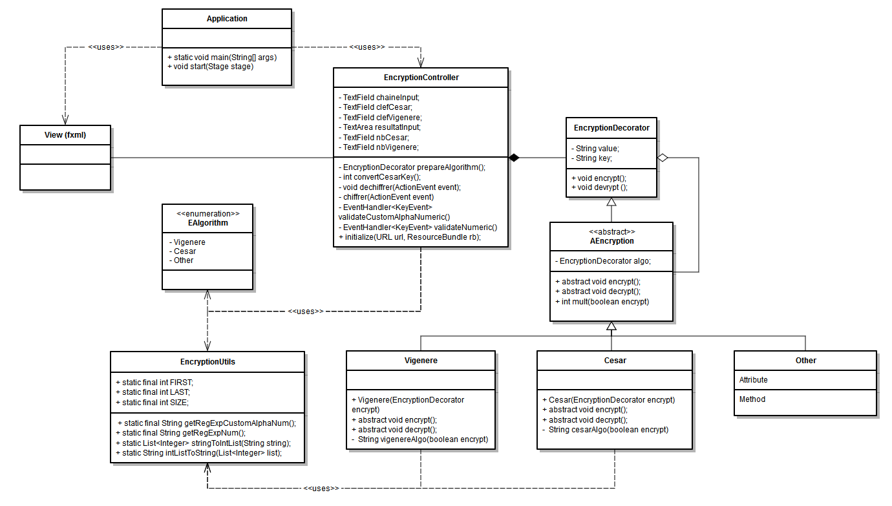

# QUA2 Encryption

Simple project for ECE QUA2 class:  
This application is used to encrypt and decrypt data.  
Two algorithms can be used: Cesar and an extended Vigenère, using characters from ' ' (space) to '~' (tilde) in the ASCII table. Special characters such as accentuated letters can not be used. You can choose how many of these algorithms you use.

## Installation instruction

Just clone it from github, and compile it.  

Or install with Docker 

Before beginning to defines a graphical interface:  
Download Xming to create a displayer and to host the container output on PC host  
Link : http://www.straightrunning.com/XmingNotes/  
Launch Xming server using the following Xming command in CMD or use the graphical interface Xlaunch :  
> xming :0 -ac -clipboard -multiwindow

In docker:  
Open the source file (Ex: cd ~/Desktop/QUA2-Encryption)
> docker build -t fx .
> docker run --rm -e DISPLAY=<192.168.99.1:0> fx			// Replace with docker IP

## Tests
A set of test have been incorporated in order to ensure the algorithms are working according to what is expected.

## Use
1. Enter the data to encrypt or decrypt
2. Enter the key for Vigenere and/or Cesar
3. Enter the number of time to loop on each algorithm
4. Click on the button to encrypt or decrypt
5. The cypher is displayed under the button

## Implementation

For this project, we wanted to implement multiple algorithm at the same time with the possibility to chain them as much as we wanted. Thus we decided to implement a design pattern decorator.  
In addition, we decided to use JavaFX as graphical interface. For this, we chose to add the design pattern MVC to the project.  

## Quality

In concern of quality issue, we used: 
* java code: JDeodorant, Codacy
* integration: ant, travis-ci
* deployment: docker 

## Contributors

Joseph CHACHOUA, Nicolas DONNAINT, Kevin GUOI, Harry HERBOCH, Aurélien STEINBERGER

## Licence

ISC
